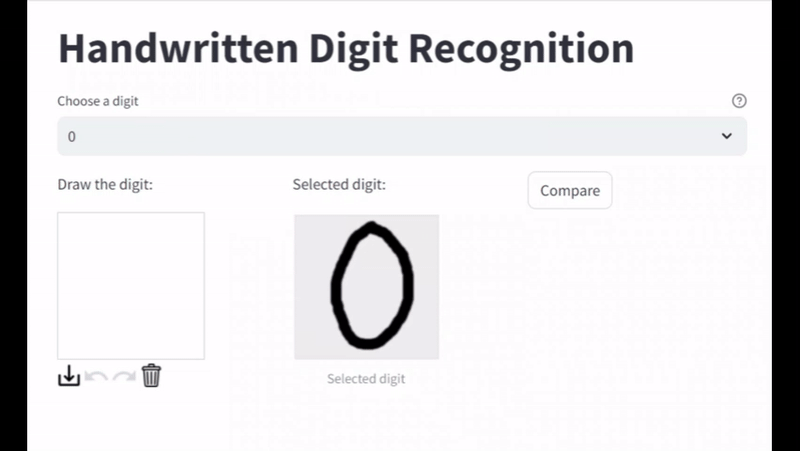

# Handwritten Digit Recognition with Cosine Similarity

[](https://github.com/astral-sh/ruff)


*<p align="center">Image credits: <a href='https://aigeekprogrammer.com/keras-python-mnist-handwritten-digit-recognition/'>AI Geek Programmer article</a></p>*

## Table of Contents

* [Problem statement](#problem-statement)
* [Directory layout](#directory-layout)
* [Running the app with Docker (Recommended)](#running-the-app-with-docker-recommended)
* [Running the app manually](#running-the-app-manually)
* [Quality code](#quality-code)
* [Checkpoints](#checkpoints)
* [References](#references)

## Problem statement

In this project, I introduce a different and naive approach to the popular problem of handwritten digit recognition, widely used in Machine Learning and Convolutional Neural Network by enthusiasts who start in this field. Maybe it is unnecessary to describe the idea behind as you have probably read, seen or implemented this kind of problems on your own, but in this opportunity I decided go through an algebraic solution to identify digits written by hand making usage of the cosine similarity metric [(See on references)](#references). 

The metric is calculated by measuring the similarity between two vectors and corresponds to the following formula:

$$ cos(\theta) = { 
    \sum\limits_{i=0}^{n-1} A_iB_i
    \over 
    \sqrt{\sum\limits_{i=0}^{n-1} {A_i^2}} \sqrt{\sum\limits_{i=0}^{n-1} {B_i^2}}
}
$$

Where *A* and *B* represent bi-dimensional arrays, denoting the digit drawn by the user and the original digit intended to be the expected figure, respectively. Though these can interchanged in the formula.

I have designed a minimal yet functional Streamlit application to showcase this algorithm: Users select a number from a dropdown menu and then proceed to draw the selected number. The result will appear after press the `Compare` button. Additionally, I have categorized the results into three groups based on the score: **Excellent** (`score > 0.7`), **Good** (`score > 0.4`) and **Incorrect** (`score < 0.4`).

The animation below illustrates how the application works:



To sum it up, the applications of the cosine similarity extend beyond simple array comparisons, it is predominantly used in Large Language Models, Recommender Systems, Information Retrieval and various other domains. Therefore, you can leverage its potential to develop a wide range of projects.

## Directory layout

```
.
├── images              # Assets for the project
│   └── digits          # Images of digits from 0 to 9
├── src                 # Directory with source python files
│   └── array_digits    # Directory with files representing arrays of digits (zero.py to nine.py)
└── tests               # Directory contianint test files

5 directories
```

## Running the app with Docker (Recommended)

1. Clone the repository:
```bash
git clone https://github.com/edcalderin/Handwritten-digit-recognition.git
```
2. Start Docker Desktop

3. Build and run the docker image:
```bash
docker build -t digit-recognition .
docker run -it --rm -p 8501:8501 digit-recognition
```

3. Go to `http://localhost:8501`

## Running the app manually

> :warning: You will need **Python 3.12** installed on your system in order to reproduce this app manually.

Run the following commands from root project directory:

1. Clone the repository:
```bash
git clone https://github.com/edcalderin/Handwritten-digit-recognition.git
```
2. Install Poetry (Skip this if you already installed it)
```bash
pip install poetry
```
3. Create and activate environment:
```bash
poetry shell
```
4. Install dependencies:
```bash
poetry install
```
5. Run the streamlit command:
```bash
python -m streamlit run src/app.py
```
6. Go to `http://localhost:8501`

## Quality code

This project used `ruff` and `pytest` to ensure the quality code:

* Linter:
```bash
ruff check .
```

* Tests:
```bash
python -m pytest tests
```


## Checkpoints

- [x] Problem description
- [x] Reproducibility
- [x] Dependency and enviroment management
- [x] Containerization (Docker with multi-stage)
- [x] Linter
- [x] Unit tests
- [x] CI/CD workflow (Linter and Unit tests)
- [ ] Cloud deployment

## ✉️ Contact
**LinkedIn:** https://www.linkedin.com/in/erick-calderin-5bb6963b/  
**e-mail:** edcm.erick@gmail.com

## Enjoyed this content?
Explore more of my work on [Medium](https://medium.com/@erickcalderin) 

I regularly share insights, tutorials, and reflections on tech, AI, and more. Your feedback and thoughts are always welcome!
